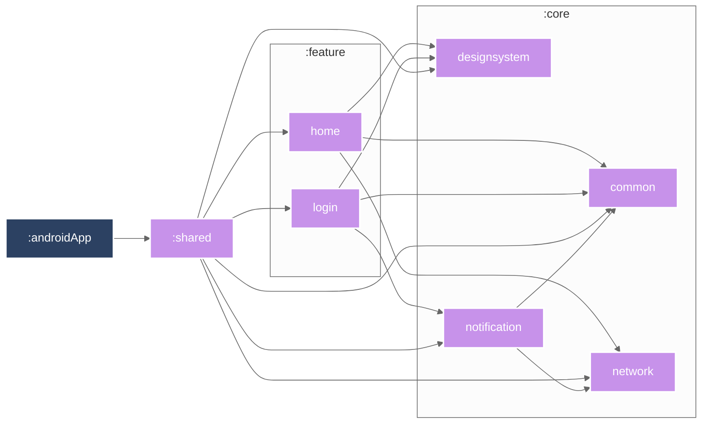

# CMP App Recipes

[](https://www.jetbrains.com/help/kotlin-multiplatform-dev/compose-multiplatform-overview.html)
[](https://kotlinlang.org/)

This project showcases a cross-platform mobile application (Android and iOS) built
using [Compose Multiplatform (CMP)](https://www.jetbrains.com/help/kotlin-multiplatform-dev/compose-multiplatform-create-first-app.html).
It serves as a practical demonstration of developing a unified application across multiple platforms
while seamlessly integrating platform-specific functionalities.

## 📂 Project Structure

The project is thoughtfully organized to clearly separate shared logic from platform-specific
implementations, ensuring maintainability and ease of navigation:

```
cmp-app-recipes/
├── androidApp/         # Android application source code and build configuration
├── iosApp/             # Xcode project and iOS application source code
├── shared/             # Core CMP module containing shared Kotlin code
│   ├── commonMain/     # Code shared between Android and iOS
│   ├── androidMain/    # Android-specific code
│   └── iosMain/        # iOS-specific code
├── build-logic/        # Custom Gradle plugins for build conventions
├── core/               # Shared modules across applications
│   ├── common/         # Generic classes and interfaces
│   ├── designsystem/   # UI design components
│   └── network/        # Network layer implementation
├── config/             # Configuration files
│   └── VERSION_NAME    # Project version information
├── feature/            # Shared feature modules
│   └── login/          # Login feature implementation
└── .github/            # GitHub Actions workflows
```

## Module Graph



## ✨ Technologies Used

This project leverages the following powerful technologies:

* **Compose Multiplatform (CMP):** The foundation for building declarative UIs that can be shared
  across platforms.
* **Kotlin:** The expressive and concise programming language powering the application.
* **Koin:** A pragmatic lightweight dependency injection framework for Kotlin.
* **Ktor:** A powerful and flexible asynchronous HTTP client for Kotlin.
* **Android Studio:** The official IDE for Android development, used for the Android app and shared
  CMP module.
* **Xcode:** Apple's integrated development environment, essential for building the iOS application.
* **GitHub Actions:** For automating build, test, and deployment workflows.

## 🛠️ Project Setup

Get started with the project by following these steps:

1. **Prerequisites:** Ensure the following tools are installed on your system:
    * **Java Development Kit (JDK):** Version 11 or higher is required.
    * **Android Studio:** Download and install from
      the [official website](https://developer.android.com/studio).
    * **Xcode:** Install from the [Mac App Store](https://apps.apple.com/us/app/xcode/id497799835).
    * **CocoaPods:** If you intend to run the iOS application, install CocoaPods by running
      `sudo gem install cocoapods` in your terminal.
    * **Kotlin Multiplatform Mobile Plugin:** Within Android Studio, navigate to
      *Preferences/Settings > Plugins*, search for "Kotlin Multiplatform Mobile", and install it.

2. **Clone the Repository:**

   ```bash
   git clone git@github.com:ricarlo-silva/cmp-app-recipes.git
   cd cmp-app-recipes
   ```

3. **Open in Android Studio:**
    * Launch Android Studio.
    * Select "Open an existing project."
    * Browse to the `cmp-app-recipes` directory and select it.

4. **Sync Project with Gradle Files:**
    * Once the project is open, Android Studio will prompt you to synchronize with the Gradle files.
      Click "Sync Now" or the Gradle sync icon (elephant with a green arrow) in the toolbar.

5. **Create `secrets.properties` file in the project root:**
    * It should contain:
        * `BASE_URL=your_base_api_url_here`
        * `API_KEY=your_api_key_here`

6. **Run the Android App:**
    * Select the `androidApp` configuration from the run configuration dropdown menu.
    * Create `google-services.json` file in the `androidApp` directory.
    * Click the "Run" button (green play icon).

7. **Run the iOS App:**
    * Open the `iosApp/iosApp.xcodeproj` file in Xcode.
    * Create `GoogleService-Info.plist` file in the `iosApp/iosApp` directory.
    * Choose a simulator or connect a physical iOS device as the target.
    * Click the "Run" button (play icon) in Xcode.

## ⚙️ Building and Testing

### Building

* **Android:**
    * **Via Android Studio:** Navigate to *Build > Assemble Project*.
    * **Via Gradle:** Open a terminal in the project root and run
      `./gradlew androidApp:assembleDebug`.
* **iOS:**
    * **Via Xcode:** Go to *Product > Build*.

### Testing

* **Android:**
    * **Unit Tests:** Right-click on the `test` directory within `androidApp` in Android Studio and
      select "Run 'All Tests'". Alternatively, use the terminal command:
      `./gradlew androidApp:testDebugUnitTest`.
    * **Instrumentation Tests:** Right-click on the `androidTest` directory within `androidApp` and
      select "Run 'All Tests'".
* **Shared Code:**
    * Right-click on the `commonTest` directory within `shared` and select "Run 'All Tests'".
      Alternatively, use the terminal command: `./gradlew shared:test`.

## 🤝 Contributing

We highly appreciate contributions to this project! Please refer to the [
`CONTRIBUTING.md`](CONTRIBUTING.md) file for detailed guidelines on how you can contribute.

## 📄 License

This project is licensed under the MIT license - see the [`LICENSE`](LICENSE) file for complete
license details.
